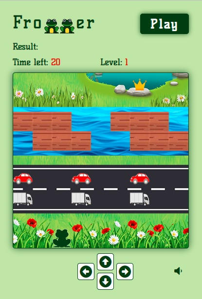

# Frogger

JavaScript retro game Frogger created as a training project.
First coded along with [Ania Kubow Youtube video](https://youtu.be/ec8vSKJuZTk?t=9080), then modified - I added:         
- levels, 
- arrow controls so the game can be played on mobile devices (on my mom's request),
- sounds,
- and styles.

It was lots of fun!

### Live Site URL

### Built with

- Semantic HTML5 markup
- CSS custom properties
- Flexbox
- CSS Grid
- Sass
- BEM

### Screenshot

### Useful
#### .toggle() for the sound controls

[DOMTokenList.toggle()](https://developer.mozilla.org/en-US/docs/Web/API/DOMTokenList/toggle) takes a token - a string representing what I want to toggle. Returns a boolean value, indicating whether token is in the list after the call or not.

#### .muted property
[Audio muted Property](https://developer.mozilla.org/en-US/docs/Web/API/HTMLMediaElement/muted)
The HTMLMediaElement.muted indicates whether the media element muted. Value is a boolean. True means muted and false means not muted.

### Acknowledgments

A big thank you to Ania Kubow & freeCodeCamp for making the video, it is such a komplex thing for learning, with great side effects for my family members!